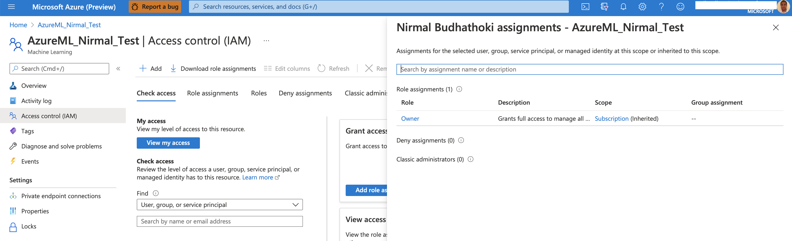

# Operationalizing Machine Learning in Azure- Bank Marketing Campaigns

This dataset contains marketing campaigns of a bank in which we can analyze the data , and build some predictive models to find new strategic ways to improve the future marketing campaigns, and target the right customers. The data is related with direct marketing campaigns of a banking institution. The classification goal is to predict if the client will subscribe to a term deposit (variable y).

The goal of this project is to use the Azure ML tools to configure a cloud-based machine learning production model, deploy it, and consume it. We will also create, publish, and consume a ML pipeline in Azure.

## Architectural Diagram

Below is the architectural diagram followed for this project, starting from setting up proper authentication, training model by automl, deploying the best model, creating pipeline, consuming the model, enable logging in app insights, and swagger documentation.  

## Key Steps
Step 1: Authentication
I am using my Azure account for this project. The azureML workspace is created, and I am the owner of it with all the required access verified by Identity and Access Management (IAM) through AAD (Azure Active Directory). For security reason, my account id is greyed out. However, authentication is set up properly as the first key step.  
  

## Screen Recording
*TODO* Provide a link to a screen recording of the project in action. Remember that the screencast should demonstrate:

## Standout Suggestions
*TODO (Optional):* This is where you can provide information about any standout suggestions that you have attempted.
