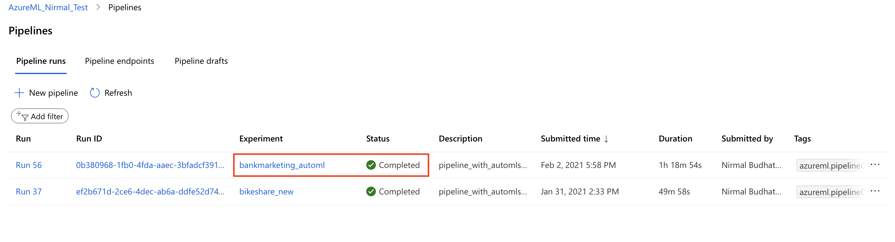

# Operationalizing Machine Learning in Azure- Bank Marketing Campaigns

This dataset contains marketing campaigns of a bank in which we can analyze the data , and build some predictive models to find new strategic ways to improve the future marketing campaigns, and target the right customers. The data is related with direct marketing campaigns of a banking institution. The classification goal is to predict if the client will subscribe to a term deposit (variable y).

The goal of this project is to use the Azure ML tools to configure a cloud-based machine learning production model, deploy it, and consume it. We will also create, publish, and consume a ML pipeline in Azure.

## Architectural Diagram

Below is the architectural diagram followed for this project, starting from setting up proper authentication, training model by automl, deploying the best model, creating pipeline, consuming the model, enable logging in app insights, and swagger documentation.  

<kbd> </kbd>

## Key Steps
### Step 1: Authentication:
I am using my Azure account for this project. The azureML workspace is created, and I am the owner of it with all the required access verified by Identity and Access Management (IAM) through AAD (Azure Active Directory). For security reason, my account id is greyed out. However, authentication is set up properly as the first key step:  

<kbd> </kbd>  

### Step 2: AutoML Experiment:
Before we set up autoML experiment, we need to make sure we have uploaded the dataset. The data set is uploaded from [this URL](https://automlsamplenotebookdata.blob.core.windows.net/automl-sample-notebook-data/bankmarketing_train.csv). We can preview the uploaded dataset:  

<kbd> </kbd>  

After the dataset is uploaded, autoML experiment is set up. The completed experiment can be verified as:  

<kbd> </kbd>  

Best Model: VotingEnsemble is the best model with accuracy **0.92049**  

<kbd> </kbd>  

### Step 3: Deploy the Best Model:
If we look at the list of models from different runs in the experiment, it is sorted by Accuracy. We selected the first one with highest accuracy (0.92). deploy the model using Azure Container Instance (ACI). By default for ACI, key based authentication is disabled. We enable the authentication and deploy the model to create endpoints that can be consumed via API.  
| **Authentication enabled**| **Deployment completed** |
| ------- | ------ | 
| <kbd> </kbd>   | <kbd> </kbd>   | 

### Step 4: Enable Application Insights:
By default, the application insights is disabled. Logs of real-time endpoints are valuable data to troubleshoot issues or just to track and optimize the performance of the model deployed as web service. We can use the get_logs() function to retrieve logs from a deployed web service. The logs may contain detailed information about any errors that occurred during deployment. 
In order to enable application insights , we can use: service.update(enable_app_insights=True). Here *service* is the variable holding webservice name and workspace information.

| **AppInsights Disabled**| **AppInsights Enabled** |
| ------- | ------ | 
| <kbd> </kbd>   | <kbd> </kbd>   | 

Following screenshot shows the visuals for logs if we go to the app insights url generated after enabling application insights to true:  

<kbd> </kbd>  

### Step 5: Swagger Documentation
Swagger UI allows us to visualize and interact with our model via REST API. It’s automatically generated after model deployment is completed and we have a webservice endpoint. The visual documentation makes it easy for back end implementation and client side consumption.

| **Swagger UI**| **How input payload looks** |
| ------- | ------ | 
| <kbd> </kbd>   |  <kbd> </kbd>  | 

### Step 6: Consume Model Endpoints:
Next step is to consume our model endpoint. The script *endpoint.py* uses RESTful API (url), and private key to run the model, and get the output in json format.  
<kbd> </kbd>  
 
 ### Step 7: Create and Publish a Pipeline:
Pipeline is an independently executable workflow of a complete machine learning task. Subtasks are encapsulated as a series of steps within the pipeline. Some of the subtasks we performed are making dataset ready (first check if dataset exists, upload if not exists), then setting up autoML config, and running the autoML experiment. Pipeline, as the name suggests is sequential steps of independent tasks, when combined together automates the complete model building process. Below are captured screenshots:

*Run widget showing pipeline is submitted:*
 
<kbd> </kbd>  

*Pipeline execution completed:*
  
<kbd> </kbd>  

*ML Studio showing completed pipeline in the list:*
  
<kbd> </kbd>  

*Details of completed pipeline:*
  
<kbd> </kbd>  

*Pipeline Published and is Active:*
  
<kbd> </kbd>  

## Screen Recording
*TODO* Provide a link to a screen recording of the project in action. Remember that the screencast should demonstrate:

## Future Improvements:

